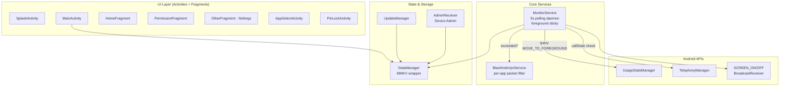

<div align="center">


# SilentGuardian

**A self-discipline companion that keeps you off the apps you can't stop opening — without ever feeling like parental control software.**

[](https://www.android.com)
[-blue)](https://developer.android.com/about/versions/nougat)
[](https://kotlinlang.org)
[](./LICENSE)
[](./update_config.json)

[English](./README.md) · **简体中文** → [README.zh-CN.md](./README.zh-CN.md)

</div>

---

> **⚠️ Notice:** This is a single-developer, Chinese-first project. English is provided for international contributors, but day-to-day commits and issue discussion are mostly in Chinese. You're welcome to contribute in either language.

## 📖 What is this

SilentGuardian is an Android app that quietly limits the **total time per day** you can spend on apps you've flagged as problematic (short-video, social feeds, games). When your quota runs out, it doesn't yell at you or block the screen — it just **cuts the network** to those specific apps via a local VPN blackhole. The app stays installed, opens normally, shows the feed, just nothing loads. The psychological effect is more "ugh, boring" than "the system is fighting me" — which is the point.

It's designed for **adults who want to self-regulate**, not for parental control over children. There's no cloud account, no remote dashboard, no analytics on you. Everything runs locally on your device.

## ✨ Key features

| Feature | What it does |
|---|---|
| ⏱️ **Daily time quota** | Set a max total time per app per day. Counted only while the app is actually in the foreground. |
| 🌙 **Bedtime mode** | Hard lockout window (e.g. 23:00–07:00) where guarded apps are blocked regardless of remaining quota. |
| 📅 **Weekday / Weekend split** | Different limits for weekdays vs. weekends. Finally let yourself breathe on Saturday. |
| 🕳️ **Per-app network blackhole** | When quota is exhausted, a local `VpnService` drops packets only for the targeted apps. Other apps and the rest of the system keep working normally. |
| 📞 **Call-aware fail-safe** | If you're on a call (`TelephonyManager.callState != IDLE`), the VPN immediately stops blocking and skips that poll cycle. No more missed calls because you ran out of TikTok time. |
| 🌒 **Screen-off pause** | `ACTION_SCREEN_OFF` suspends the polling coroutine. Quota only burns while the screen is on and the app is foreground. |
| 📅 **Day-rollover reset** | Doesn't trust system day-change broadcasts. Compares today's date string against the stored last-seen date every cycle, force-resets if mismatched. |
| 🛡️ **Anti-uninstall + PIN lock** | Optional Device Admin activation prevents uninstall; PIN gate prevents changing settings in a moment of weakness. |
| 🌐 **Bilingual UI** | Full Simplified Chinese and English string resources. System locale picks automatically. |

## 📸 Screenshots

<p align="center">
  <a href="./screenshots/3_main_dashboard.png"></a>
  <a href="./screenshots/4_app_selection_management.png"></a>
  <a href="./screenshots/5_time_limit_setting.png"></a>
  <a href="./screenshots/6_pin_setting_validation.png"></a>
</p>

<details>
<summary><b>View all 9 screens</b></summary>

| | | |
|---|---|---|
|  |  |  |
|  |  |  |
|  |  |  |

</details>

## 🏗️ Architecture



**Polling loop (every 5 seconds):**

1. Check `TelephonyManager.callState` — if not `IDLE`, disable VPN block, skip cycle.
2. Compare today's date with stored date — if different, reset all counters.
3. Query `UsageStatsManager.queryEvents()` for most recent `MOVE_TO_FOREGROUND` event.
4. If foreground app is in the guarded list, increment its time counter by Δ.
5. If any counter exceeds its limit (or current time is inside bedtime window), establish `BlackholeVpnService` targeting that app's UID.
6. Otherwise, ensure VPN is stopped.

## 🧱 Tech stack

| Layer | Choice | Why |
|---|---|---|
| Language | Kotlin + Coroutines | Single-language codebase per project convention |
| UI | Material Components + ViewBinding-less (findViewById) | Stable, no Compose migration burden |
| Local storage | [MMKV](https://github.com/Tencent/MMKV) 1.3.x | mmap-based, survives crashes, 100× faster than SharedPreferences |
| Permissions | [XXPermissions](https://github.com/getActivity/XXPermissions) 18.x | Handles the messy cross-version permission matrix |
| Utilities | [AndroidUtilCode](https://github.com/Blankj/AndroidUtilCode) 1.31.x | Package list, app icons, common helpers |
| Analytics | [Microsoft Clarity](https://clarity.microsoft.com) | Anonymous session recordings (opt-in by installation) |

**Build tooling:** Gradle 9.x, AGP, JDK 17, `minSdk=24`, `targetSdk=34`.

## 🚀 Build & install

### Prerequisites
- Android Studio Ladybug or newer (or just JDK 17 + Gradle 9.x CLI)
- An Android device or emulator running Android 7.0+ (API 24+)

### Build

```bash
# Debug build (no signing setup required)
gradle assembleDebug

# Release build (requires your own keystore — see below)
cp app/keystore.properties.example app/keystore.properties
# Edit keystore.properties to point to your keystore + password
gradle assembleRelease
```

> **Note on signing:** The release `keystore.properties` and `release.keystore` are gitignored. The repository's build will produce an unsigned release APK unless you provide your own. The maintainer's production signing key is **never** in the repo — see [Security notes](#-security-notes).

### Install

```bash
adb install -r app/build/outputs/apk/debug/app-debug.apk
```

Or grab the latest signed release APK from the [official download endpoint](https://www.yes-tek.com/assets/apk/SilentGuardian.apk).

### First-run setup

The app walks you through a strict permission chain — this is intentional, each one is required and the order avoids dialog overlap:

1. **Notifications** (Android 13+) — for the foreground service notification.
2. **Usage access** (`PACKAGE_USAGE_STATS`) — required to know which app is in the foreground.
3. **Battery optimization exemption** — so the OS doesn't kill the polling daemon.
4. **VPN consent** — shown the first time the block triggers.
5. **Device Admin** (optional) — for anti-uninstall protection.

## 🔐 Permissions explained

| Permission | Why it's needed |
|---|---|
| `BIND_VPN_SERVICE` | The blocking mechanism itself — local VPN with no external server. |
| `FOREGROUND_SERVICE` + `FOREGROUND_SERVICE_SPECIAL_USE` | Keeps `MonitorService` alive. Android 14 requires the special-use subtype declaration. |
| `PACKAGE_USAGE_STATS` | The only reliable way to know which app is currently in the foreground. |
| `REQUEST_IGNORE_BATTERY_OPTIMIZATIONS` | Without this, Doze mode suspends the 5s polling within minutes of screen-off. |
| `BIND_DEVICE_ADMIN` | Optional. Used only if you enable anti-uninstall protection. |
| `RECEIVE_BOOT_COMPLETED` | Auto-restart the daemon after device reboot. |
| `POST_NOTIFICATIONS` | Android 13+ requirement for the foreground notification. |
| `QUERY_ALL_PACKAGES` | To let you pick from all installed apps in the guarded-apps picker. |
| `INTERNET`, `MODIFY_AUDIO_SETTINGS` | Reserved for the planned "AI voice companion" feature. |

## 🛡️ Fail-safes (the most important section)

This app controls the user's network. **"Zero collateral damage to other phone functionality" is the single hardest constraint.** Every one of these is in code, not aspirational:

- **📞 Call protection:** checked at the *start* of every polling cycle. Off-hook = unblock immediately, skip counting. *Never* miss a call because of quota.
- **🔌 Lifecycle hardening:** `MonitorService.onDestroy()` is guaranteed to tear down the VPN. Even on force-stop.
- **💥 Crash self-heal:** `Thread.setDefaultUncaughtExceptionHandler` is registered in `App.kt`. First action on any uncaught crash: stop the VPN, restore network.
- **📅 Day-rollover:** system day-change broadcasts are unreliable across OEMs. We re-derive "today" from `LocalDate.now()` on every cycle.
- **🌒 Screen-off suspend:** `ACTION_SCREEN_OFF` pauses the polling coroutine. No phantom drain while in your pocket.
- **💤 Doze jump detection:** if a polling interval measures >30s of perceived time, the timestamp is reset rather than counting it as one tick (which would otherwise let you rack up "5 seconds" per cycle while actually playing for 30).

Comments in code are tagged `[Failsafe]` or `[Hack]` so future maintainers (human or AI) know not to "clean up" what looks redundant.

## 🗺️ Roadmap

- [x] Core polling + per-app VPN block
- [x] Daily quota + per-session limit + cooldown
- [x] Weekday/weekend split
- [x] Bedtime mode
- [x] PIN lock + Device Admin anti-uninstall
- [x] In-app self-update (signed APK from configured URL)
- [ ] **AI voice companion** — when blocked, the mic-based assistant offers a 60-second voice interaction as a "soft exit ramp" away from the timed-out app. (Tracked in [docs/mic_test_demo.md](./docs/mic_test_demo.md).)
- [ ] Per-app granularity for bedtime window
- [ ] Widget showing remaining quota today
- [ ] Companion WearOS tile

## 🤝 Contributing

This is a small project, mostly maintained by one person. PRs are welcome, especially for:

- Bug fixes that maintain the **zero-collateral-damage** invariant
- Localization to more languages (`values-<locale>/strings.xml`)
- OEM-specific compatibility fixes (Xiaomi, Huawei, Oppo, Vivo boot-time quirks)

Please read [CLAUDE.md](./CLAUDE.md) and [AGENTS.md](./AGENTS.md) first — they encode the architectural constraints that aren't obvious from the code alone.

### Commit convention

Conventional Commits (`feat:`, `fix:`, `refactor:`, `chore:`). See `git log` for examples.

## 🔒 Security notes

- The maintainer's production signing keystore was rotated before open-sourcing. The old one is **scrubbed from git history**. Anyone who cloned before rotation still has a stale copy — this is unavoidable.
- If you find a security issue, please email **weinaike@163.com** before opening a public issue.

## 📄 License

Copyright © 2025–present Hangzhou Qiantang Yuesi Software Studio.

Distributed under the [GNU General Public License v3.0](./LICENSE).

Any derivative distribution must:
1. Keep the source open under the same license
2. Disclose modifications clearly
3. Include the original copyright and license

This is intentionally **not** MIT/Apache. If you want to embed SilentGuardian into a closed-source product, contact the maintainer for a commercial license.

## 🙏 Acknowledgements

- [Tencent MMKV](https://github.com/Tencent/MMKV) — fast local storage
- [XXPermissions](https://github.com/getActivity/XXPermissions) — sane permission handling
- [AndroidUtilCode](https://github.com/Blankj/AndroidUtilCode) — utility belt
- [Microsoft Clarity](https://clarity.microsoft.com) — anonymous UX telemetry
