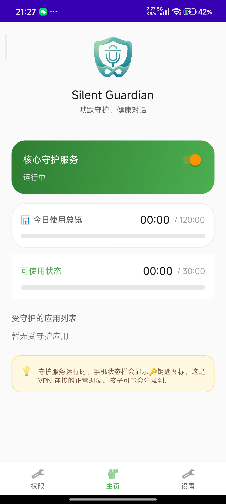
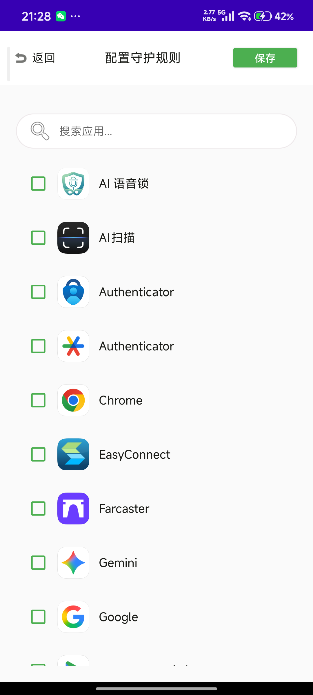
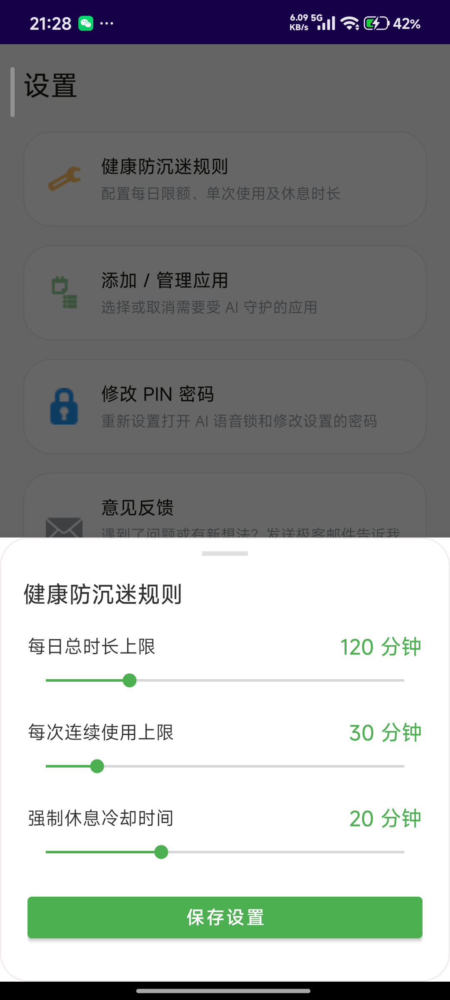
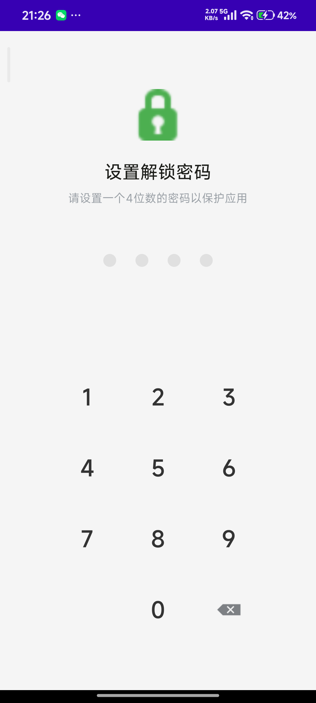
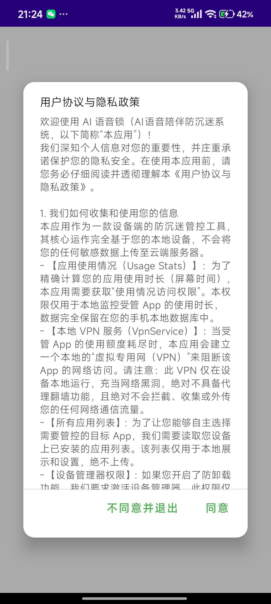
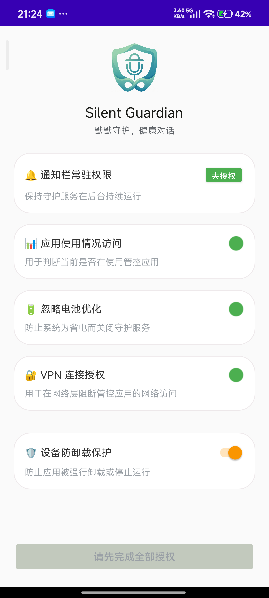
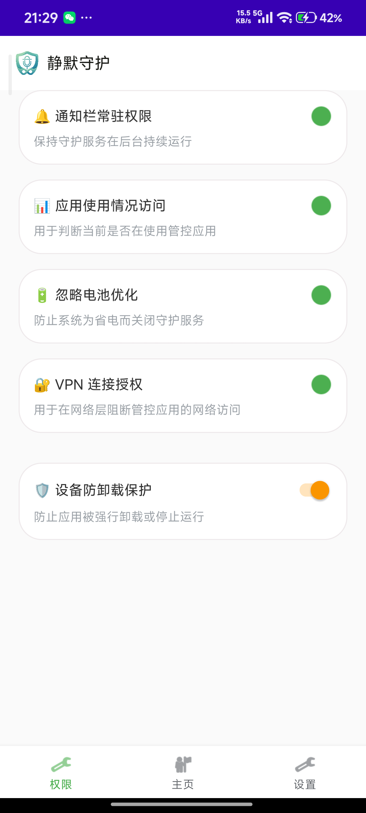
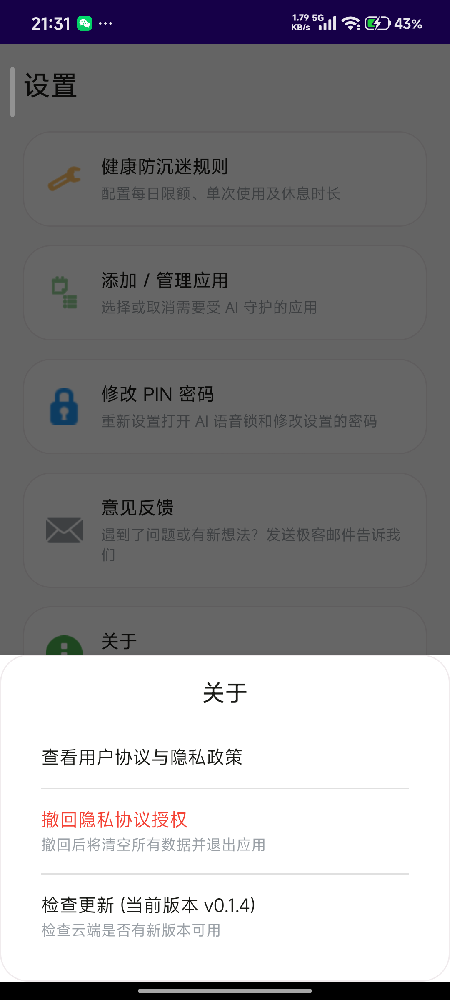
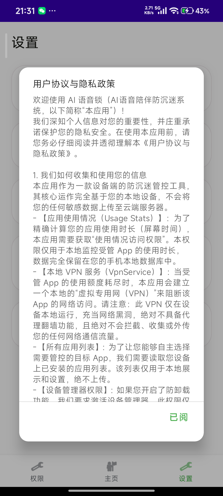
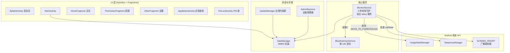

<div align="center">


# SilentGuardian（沉默守护者）

**一个不像家长控制软件、却让你戒掉"再刷五分钟"的自律陪伴 App。**

[](https://www.android.com)
[-blue)](https://developer.android.com/about/versions/nougat)
[](https://kotlinlang.org)
[](./LICENSE)
[](./update_config.json)

**简体中文** · English → [README.md](./README.md)

</div>

---

> **⚠️ 说明：** 这是单人维护的项目，主要面向中文用户。README 同时提供英文版（[README.md](./README.md)），但日常 commit、issue、PR 讨论默认中文。欢迎中英任意语言贡献。

## 📖 这是什么

SilentGuardian 是一个 Android App，会**安静地限制你每天能花在那些"打开就停不下来"的应用上的总时长**（短视频、社交信息流、游戏）。

时间用完后，它**不会**像家长控制那样粗暴锁屏或弹窗骂你——它只是**只对那几个被守护的应用断网**：通过一个本地的 VPN 黑洞服务丢包。应用照常打开、信息流照样滑动，但**什么都加载不出来**。心理效果是"好无聊啊，关了算了"而不是"系统在和我作对"——这就是设计意图。

它的目标用户是**想自我约束的成年人**，不是给孩子用的家长控制工具。没有云端账号、没有远程仪表盘、没有上传你的行为数据。**所有逻辑都在本机运行。**

## ✨ 核心功能

| 功能 | 实际效果 |
|---|---|
| ⏱️ **每日时长上限** | 给每个被守护的应用设一个每日总时长上限。只有应用确实在前台时才计时。 |
| 🌙 **睡眠安息模式** | 设定硬封锁窗口（例如 23:00–07:00），即使还有配额，被守护的应用也无法使用。 |
| 📅 **工作日 / 周末双轨** | 工作日和周末可以设完全不同的额度。让自己在周六喘口气。 |
| 🕳️ **应用级网络黑洞** | 配额耗尽后，本地 `VpnService` 只丢那一个应用的包。其它应用和系统正常工作。 |
| 📞 **通话防误伤** | 检测 `TelephonyManager.callState`。一旦不处于 `IDLE`（摘机/通话中），立即解除所有阻断，跳过该轮计次。**永远不会因为刷抖音超时错过电话。** |
| 🌒 **息屏挂起** | `ACTION_SCREEN_OFF` 挂起轮询协程。只有屏幕亮着且应用在前台时才烧配额。 |
| 📅 **跨日清零** | 不信任系统的跨日广播。每个轮询周期都用今天的日期字符串与存储的"最后记录日期"比对，跨日则强制清零。 |
| 🛡️ **防卸载 + PIN 锁** | 可选的设备管理器激活防止卸载；PIN 锁防止"意志薄弱时改设置"。 |
| 🌐 **中英双语 UI** | 完整的简体中文 + 英文文案资源，跟随系统语言自动切换。 |

## 📸 应用截图

<p align="center">
  <a href="./screenshots/3_main_dashboard.png"></a>
  <a href="./screenshots/4_app_selection_management.png"></a>
  <a href="./screenshots/5_time_limit_setting.png"></a>
  <a href="./screenshots/6_pin_setting_validation.png"></a>
</p>

<details>
<summary><b>查看全部 9 张截图</b></summary>

| | | |
|---|---|---|
|  |  |  |
|  |  |  |
|  |  |  |

</details>

## 🏗️ 架构



**轮询循环（每 5 秒一次）：**

1. 检查 `TelephonyManager.callState`——非 `IDLE` 立即解除 VPN 阻断，跳过该轮。
2. 用今天的日期字符串与存储的日期对比——不一致则强制清零所有计数。
3. 查询 `UsageStatsManager.queryEvents()` 倒序找最近的 `MOVE_TO_FOREGROUND` 事件，确定当前前台应用。
4. 若前台应用在被守护列表里，按 Δ 时间增量累加其计数。
5. 若任一计数超过限额（或当前时间落在睡眠窗口内），启动 `BlackholeVpnService` 并只针对该 UID 丢包。
6. 否则确保 VPN 已停止。

## 🧱 技术栈

| 层 | 选择 | 为什么 |
|---|---|---|
| 语言 | Kotlin + Coroutines | 项目规范统一单语言，禁混 Java |
| UI | Material Components + findViewById | 稳定，无 Compose 迁移负担 |
| 本地存储 | [MMKV](https://github.com/Tencent/MMKV) 1.3.x | 基于 mmap，崩溃也保数据，比 SharedPreferences 快 100 倍 |
| 权限 | [XXPermissions](https://github.com/getActivity/XXPermissions) 18.x | 处理各系统版本权限矩阵的脏活 |
| 工具 | [AndroidUtilCode](https://github.com/Blankj/AndroidUtilCode) 1.31.x | 包名列表、应用图标、常用 helper |
| 数据分析 | [Microsoft Clarity](https://clarity.microsoft.com) | 匿名行为录像（安装即视为启用） |

**构建工具：** Gradle 9.x, AGP, JDK 17, `minSdk=24`, `targetSdk=34`。

## 🚀 构建与安装

### 前置条件
- Android Studio Ladybug 或更新（或仅 JDK 17 + Gradle 9.x 命令行）
- Android 7.0+（API 24+）的真机或模拟器

### 构建

```bash
# Debug 构建（无需签名配置）
gradle assembleDebug

# Release 构建（需要自备 keystore，见下方说明）
cp app/keystore.properties.example app/keystore.properties
# 编辑 keystore.properties 指向你的 keystore 和密码
gradle assembleRelease
```

> **签名说明：** 仓库中的 `keystore.properties` 和 `release.keystore` 都被 gitignore 排除。仓库默认构建出**未签名**的 release APK，需要你自己提供签名。维护者的生产签名 keystore **永远不会**进入仓库——详见 [安全说明](#-安全说明)。

### 安装

```bash
adb install -r app/build/outputs/apk/debug/app-debug.apk
```

或从[官方下载直链](https://www.yes-tek.com/assets/apk/SilentGuardian.apk)获取最新签名 APK。

### 首次启动设置

App 会引导你走一条严格的权限链——顺序是故意设计的，避免弹窗重叠：

1. **通知权限**（Android 13+）——前台服务通知需要。
2. **使用情况访问**（`PACKAGE_USAGE_STATS`）——确定前台应用的唯一可靠方式。
3. **电池优化白名单**——否则系统会在息屏后几分钟内杀掉轮询守护。
4. **VPN 授权**——首次触发阻断时弹出。
5. **设备管理器**（可选）——防卸载保护。

## 🔐 权限说明

| 权限 | 用途 |
|---|---|
| `BIND_VPN_SERVICE` | 阻断机制本身——本地 VPN，**不连接任何外部服务器**。 |
| `FOREGROUND_SERVICE` + `FOREGROUND_SERVICE_SPECIAL_USE` | 让 `MonitorService` 常驻。Android 14 强制要求声明 specialUse 子类型。 |
| `PACKAGE_USAGE_STATS` | 唯一可靠知道当前前台应用的方式。 |
| `REQUEST_IGNORE_BATTERY_OPTIMIZATIONS` | 否则 Doze 模式会在息屏几分钟内挂起 5 秒轮询。 |
| `BIND_DEVICE_ADMIN` | 可选。仅在启用防卸载时使用。 |
| `RECEIVE_BOOT_COMPLETED` | 开机自启。 |
| `POST_NOTIFICATIONS` | Android 13+ 前台通知必需。 |
| `QUERY_ALL_PACKAGES` | 在应用选择器中列出所有已安装应用。 |
| `INTERNET`, `MODIFY_AUDIO_SETTINGS` | 为规划的"AI 语音陪伴"功能预留。 |

## 🛡️ 兜底机制（本仓库最重要的章节）

这个 App 控制用户的网络。**"对原手机其它功能 0 误伤"是整个系统最硬的约束**。下面每一条都已落地为代码，不是规划：

- **📞 通话防误伤：** 每一轮询**最开始**检查 `TelephonyManager.callState`。摘机 = 立即解除 VPN 阻断 + 跳过该轮计次。**永远不会因为配额耗尽错过电话。**
- **🔌 生命周期兜底：** `MonitorService.onDestroy()` **必然**强制关闭 VpnService 恢复网络。即使被强制停止。
- **💥 崩溃自愈：** `App.kt` 中注册 `Thread.setDefaultUncaughtExceptionHandler`。任何未捕获异常的首个动作：终止 VpnService 恢复网络。
- **📅 跨日清零：** 不依赖系统的跨日广播（各 OEM 实现不准）。每个周期用 `LocalDate.now()` 重新推导"今天"。
- **🌒 息屏挂起：** `ACTION_SCREEN_OFF` 挂起轮询协程。口袋里不会幽灵耗电。
- **💤 Doze 跳变检测：** 若某次轮询间隔感知时间 >30 秒，重置时间戳而非按一次 tick 计数（否则你实际玩了 30 秒却只算 5 秒）。

代码里这些位置都打了 `[Failsafe]` 或 `[Hack]` 注释，提醒后续接手的人（人或 AI）**不要把这些"看似冗余"的代码精简掉**。

## 🗺️ 路线图

- [x] 核心轮询 + 应用级 VPN 阻断
- [x] 每日额度 + 单次时长上限 + 冷却休息
- [x] 工作日/周末双轨
- [x] 睡眠安息模式
- [x] PIN 锁 + 设备管理器防卸载
- [x] 应用内自更新（从配置 URL 拉取签名 APK）
- [ ] **AI 语音陪伴**——被阻断时，麦克风对话助手提供 60 秒语音互动，作为"软出口坡道"引导用户离开超时应用。（原型：[docs/mic_test_demo.md](./docs/mic_test_demo.md)）
- [ ] 每个应用独立的睡眠窗口
- [ ] 桌面 widget 显示当日剩余配额
- [ ] WearOS 磁贴

## 🤝 贡献

这是一个单人维护的小项目，欢迎 PR，尤其是：

- 维持"0 误伤"不变量前提下的 bug 修复
- 更多语言的本地化（`values-<locale>/strings.xml`）
- OEM 兼容性修复（小米、华为、OPPO、Vivo 的开机/保活差异）

提交 PR 前请先阅读 [CLAUDE.md](./CLAUDE.md) 和 [AGENTS.md](./AGENTS.md)——这两份文档编码了那些光看代码看不出来的架构约束。

### Commit 规范

强制 Conventional Commits（`feat:` / `fix:` / `refactor:` / `chore:`）。见 `git log` 示例。

## 🔒 安全说明

- 维护者的生产签名 keystore 在开源前已轮换。**旧 keystore 已从 git 历史中清除**。轮换前 clone 过仓库的人仍持有旧文件——这不可逆。
- 如发现安全问题，请先邮件 **weinaike@163.com**，不要直接开公开 issue。

## 📄 协议

版权所有 © 2025 至今 杭州市钱塘区越思软件开发工作室。

基于 [GNU General Public License v3.0](./LICENSE) 分发。

任何衍生分发必须：
1. 以同样协议开源
2. 清晰披露修改内容
3. 保留原始版权和协议

**故意没有选 MIT/Apache。** 如果你想把 SilentGuardian 嵌入闭源商业产品，请联系维护者洽谈商业授权。

## 🙏 致谢

- [Tencent MMKV](https://github.com/Tencent/MMKV)——极速本地存储
- [XXPermissions](https://github.com/getActivity/XXPermissions)—— sane 权限处理
- [AndroidUtilCode](https://github.com/Blankj/AndroidUtilCode)——工具百宝箱
- [Microsoft Clarity](https://clarity.microsoft.com)——匿名 UX 遥测
